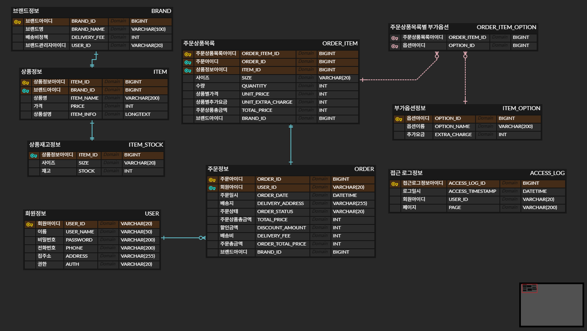
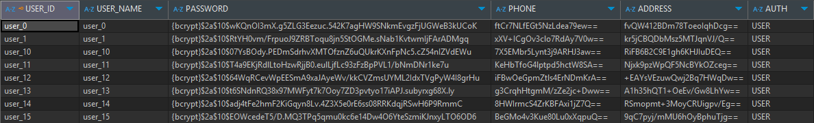
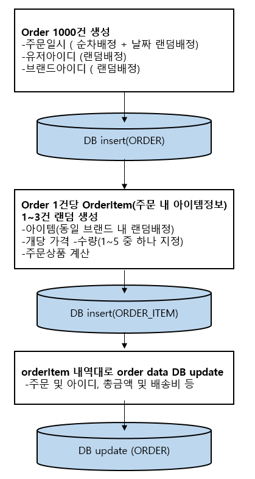

# 🧾 버킷플레이스 백엔드 과제

## 📁 사전 준비

**샘플 데이터 위치**
+ C:/Temp/jsonUpload/sample_user_log.json 

**개발 환경**
- **Java**: JDK 17
- **IDE**: IntelliJ
- **Framework**: Spring Boot 3.4.4
- **DB**: MySQL & MyBatis
- **Build Tool**: Gradle

**사용 포트**
- **Java 서버**: `8081`
- **MySQL**: `13306`

**데이터 덤프 파일 위치**
+ src/main/resources/dumpFile

>테이블을 모두 생성 후, 코드스크립트를 순차적으로 수행시 data insert 가 됩니다. 
---

## 📊 ER-Diagram
 

---

## 🧩 코드 설명

**테스트 클래스**: `StoreManagingSystemApplicationTests.java`
> 각 항목은 해당 클래스의 메서드를 `run`하여 실행할 수 있습니다.

---
### ✅ 2-a. 회원 정보 생성

- **메서드명**: `setUsers`
- **기능**:
    - 활동 로그에서 추출한 회원 ID 수만큼 회원 정보 생성
    - ID 외 정보는 임의 값 사용
    - **암호화 필드**:
        - `password`: 단방향 암호화 → **bcrypt**
        - `phone`, `address`: 양방향 암호화 → **AES-256**

> 🔐 암호화 적용 예시  

---

### ✅ 2-b. 접근 로그 저장

- **메서드명**: `setAccessLog`
- **기능**:
    - JSON 활동 로그 파일 데이터를 `ACCESS_LOG` 테이블에 저장

---

### ✅ 2-c. 주문 데이터 생성

- **메서드명**: `setOrders`
- **기능**:
    - 임의의 주문 **1,000건** 생성 후 저장
> 🔽 아래 도식은 주문 데이터 생성 전체 흐름을 시각적으로 설명합니다.

---

### ✅ 2-d. 로그파일 DB 저장

- **메서드명**: `setAccessLog`
- **기능**:
    - 활동로그파일의 데이터를 로그 테이블에 저장

---
## 🧩 쿼리 조회
**쿼리 파일 위치**: `src/main/ressources/queryFile/testQuery.sql`

