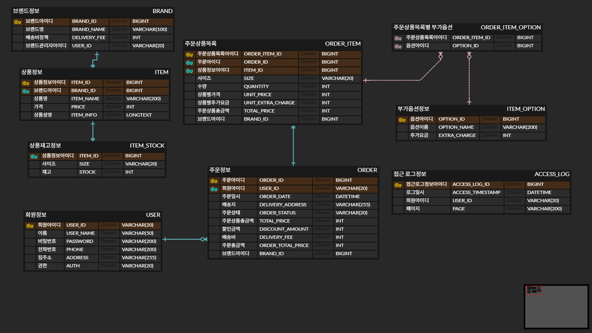
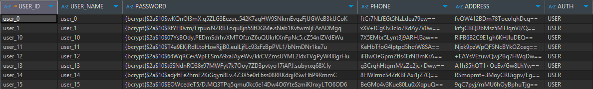
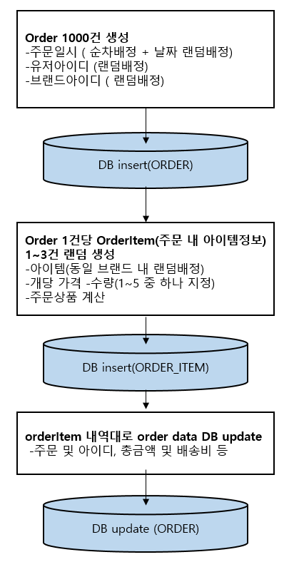
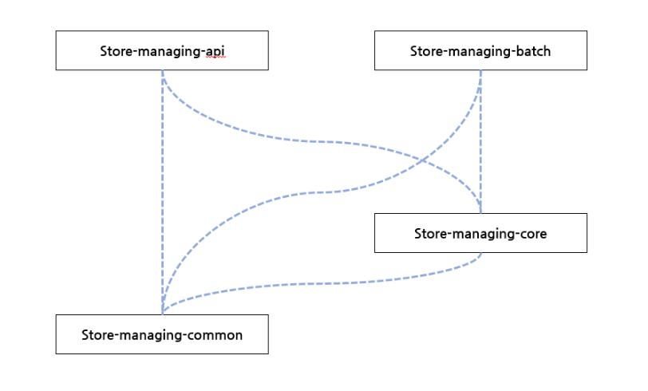

# 🧾 쇼핑몰 관리 시스템(storeManagingSystem)

## 📁 사전 준비

**샘플 데이터 위치**
+ C:/Temp/jsonUpload/sample_user_log.json 

**개발 환경**
- **Java**: JDK 17
- **IDE**: IntelliJ
- **Framework**: Spring Boot 3.4.4
- **DB**: MySQL & MyBatis
- **Build Tool**: Gradle

**사용 포트**
- **Java 서버**: `8081`
- **MySQL**: `13306`

**데이터 덤프 파일 위치**
+ store-managing-api 모듈 내부 src/main/resources/dumpFile

>테이블을 모두 생성 후, 코드스크립트를 순차적으로 수행시 data insert 가 됩니다. 

## 📊 ER-Diagram
 

---

## 🧩 코드 설명

**테스트 클래스**: `StoreManagingSystemApplicationTests.java`
> 각 항목은 해당 클래스의 메서드를 `run`하여 실행할 수 있습니다.

### ✅ 2-a. 회원 정보 생성

- **메서드명**: `setUsers`
- **기능**:
    - 활동 로그에서 추출한 회원 ID 수만큼 회원 정보 생성
    - ID 외 정보는 임의 값 사용
    - **암호화 필드**:
        - `password`: 단방향 암호화 → **bcrypt**
        - `phone`, `address`: 양방향 암호화 → **AES-256**

> 🔐 암호화 적용 예시  

### ✅ 2-b. 접근 로그 저장

- **메서드명**: `setAccessLog`
- **기능**:
    - JSON 활동 로그 파일 데이터를 `ACCESS_LOG` 테이블에 저장

### ✅ 2-c. 주문 데이터 생성

- **메서드명**: `setOrders`
- **기능**:
    - 임의의 주문 **1,000건** 생성 후 저장
> 🔽 아래 도식은 주문 데이터 생성 전체 흐름을 시각적으로 설명합니다.

### ✅ 2-d. 로그파일 DB 저장

- **메서드명**: `setAccessLog`
- **기능**:
    - 활동로그파일의 데이터를 로그 테이블에 저장

---

## 🧩 쿼리 조회
**쿼리 파일 위치**: `store-managing-api 모듈 내부 src/main/ressources/queryFile/testQuery.sql`

---
## 🧩 멀티 모듈 추가

### ✅ 멀티 모듈 구성
<pre> 📦 storeManagingSystem
  ┣ 📁 store-managing-api ← 실제 애플리케이션 실행 (Controller, ApplicationTest) 
  ┣ 📁 store-managing-core ← Domain, Service, Repository 
  ┣ 📁 store-managing-common ← 공통 DTO, Util, Enum 
  ┗ 📁 store-managing-batch ← Spring Batch 전용 Job/Step 정의 </pre>

 

### ✅ 의존성 구조
> 🔽 아래 도식은 상위 모듈이 하위 모듈의 의존 관계에 있음을 표현합니다 
 

---

## 🧩 Docker 를 이용한 로컬 개발환경 구축

- **개발 환경 :**
  - Docker : `28.0.4`
  - Docker Compose : `2.34.0`
  - OS : `Window 10`
  - Docker desktop 사용

🛠️ Docker 설정 위치
- **설정 파일:** `docker-compose.yml`

---
## 🧩 Batch 모듈 추가

- **개요 :**
  - 멀티 모듈 구조, Tasklet 기반의 배치 처리 방식을 사용하였습니다.
  - 10만건 데이터가 포함된 sample_user_log.json 파일을 읽어 DB 에 저장하는 프로세스를 구현하였습니다.

### ⚙️ 사전 준비 사항

- **application.yml 작성**
- **Spring Batch 메타 테이블 생성**
  - 경로 : 
`store-managing-batch\src\main\resources\batchTableDDL\batchTableDDL.sql`

### ✅ 배치 구성

- **실행(테스트) 클래스 :** SpringBatchApplicationTest.java
- **Job 구성 클래스 :** BatchConfig.java
  - Job Name : `jsonToDbJob`
  - Step Name : `jsonToDbStep`
- **Tasklet 클래스 :** JsonToDbBatchTasklet.java <--- 실제 비즈니스 로직이 수행되는 곳

### ✅ 실행결과
access_log 테이블 비운 후 SpringBatchApplicationTest 의 batchRun() 실행 
**-> 해당 테이블에 데이터가 들어감**

